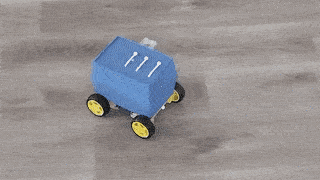

# ROS2 Vision Rover (In Progress)

### Technologies
- ROS2
- Python
- C++
- OpenCV
- Arduino
- Raspberry Pi

---

This is a **work-in-progress** project aimed at developing a four-wheel robot for environment mapping and vision-based tasks. The robot integrates:

- **LiDAR** for environment mapping
- **Camera** for vision processing
- **Remote control** capabilities

Currently, this repository contains **early-stage** resources, including a photo of the robot and some initial code.

---

### Final Robot Video

*(Placeholder for the current version of the robot)*

---

### Upcoming Features
- Full integration of ROS2 with LiDAR and camera modules
- Remote control functionality
- Detailed project documentation

---

## Project Stages:

### Stage 11: Future Work
#### Objective:
Plan potential improvements and extensions to the project.
#### Ideas for Future Development:
- **Add SLAM:** Integrate SLAM algorithms for autonomous navigation.
- **Implement Object Detection:** Use the camera stream for computer vision tasks.
- **Path Planning:** Add a path-planning algorithm for obstacle avoidance.
- **Autonomous Modes:** Develop fully autonomous behaviors using LIDAR and camera data.
_______________

### Stage 3: Robot Movement Test (Completed)
- The robot successfully moves, controlled by an Arduino.

### Stage 2: Robot Assembly (Completed)
#### The current assembly includes a four-wheel chassis with the following components:
- The motors are connected to the Arduino via the L298N motor driver module
- LiDAR module for mapping the environment
- Camera module for real-time vision processing
- Raspberry Pi to run ROS2 and manage communication between the modules
- Power system: The robot uses a rechargeable battery pack to power all electronics.
- Wiring & Electronics: Wires are routed neatly, ensuring safe connections between the Raspberry Pi, Arduino, motor drivers, and sensors.
- Mounting: All components are securely mounted on the robot chassis, leaving space for future upgrades.

### Stage 1: Project Planning and Hardware Selection (Completed)
#### Objective:
Define the project scope, select components, and prepare for hardware and software integration.
#### Tasks:
##### Set Project Goals:
- Build a remotely controlled mobile robot using ROS2.
- Integrate RPLIDAR for obstacle detection and mapping.
- Add a camera for real-time video streaming.
##### Select Components:
- Raspberry Pi: Host ROS2 and manage sensors.
- PC Workstation: Host ROS2 for development and remote control.
- Arduino: Control motors via an L298N driver.
- RPLIDAR A1: Provide realtime 2D scans of the environment.
- Camera (Pi Camera 1.3): Stream live video.
- Power Suply 1: 5V for Raspberry Pi and Arduino
- Power Suply 2: 14.8V for motors and motor driver
- Motors, wheels, chassis, and USB cables.
##### Software:
- ROS2 Humble: ROS Distributive istalled on Pi and PC Workstation
- Ubuntu Server 22.04: Raspberry Pi OS
- Ubuntu Desktop 22.04: Workstation OS
- RViz2: For LIDAR visualization and data monitoring.
- Arduino IDE: For programming and uploading code to the Arduino.
- Visual Studio Code: For writing and managing ROS2 nodes.

---

Feel free to follow along and stay tuned for updates as the project progresses!
