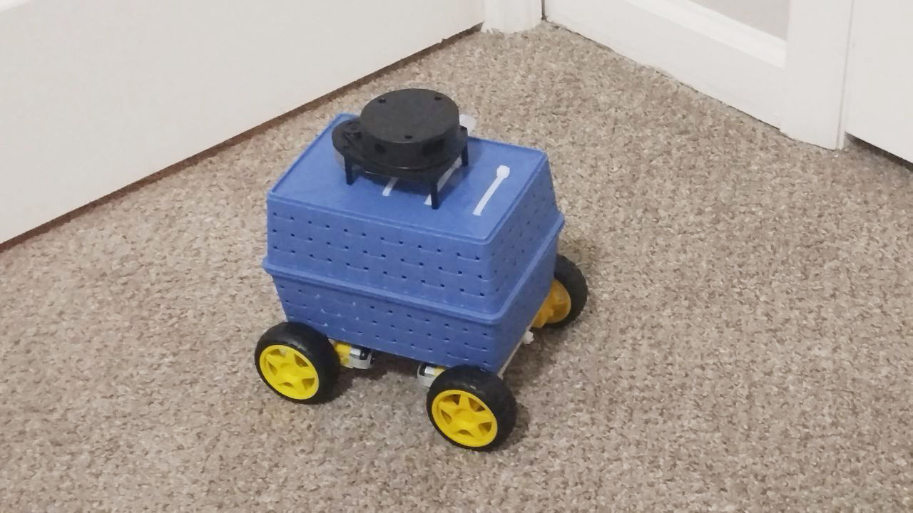

# ROS2 Vision Rover (In Progress)

### Technologies
- ROS2
- Python
- C++
- OpenCV
- Arduino
- Raspberry Pi

---

This is a **work-in-progress** project aimed at developing a four-wheel robot for environment mapping and vision-based tasks. The robot integrates:

- **LiDAR** for environment mapping
- **Camera** for vision processing
- **Remote control** capabilities

Currently, this repository contains **early-stage** resources, including a photo of the robot and some initial code.

---

### Photo
  
*(Placeholder for the current version of the robot)*

---

### Upcoming Features
- Full integration of ROS2 with LiDAR and camera modules
- Remote control functionality
- Detailed project documentation

---

Feel free to follow along and stay tuned for updates as the project progresses!
